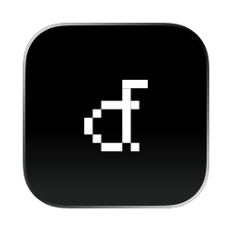
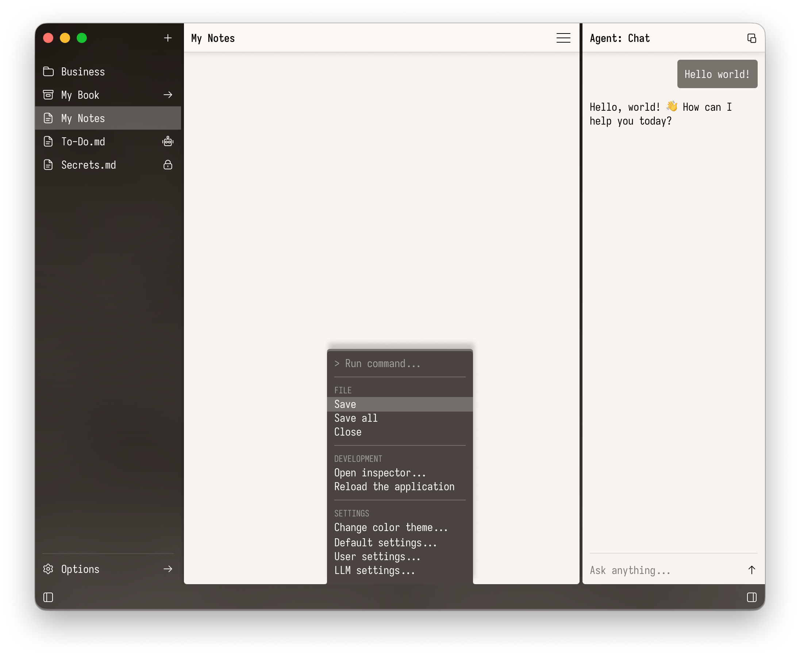

<p align="center">
  
</p>

<h1 align="center">DarkForest Editor</h1>

<p align="center">
  A calm, local-first workspace for notes, files, and AI-assisted writing.
</p>

<p align="center">
  
</p>

DarkForest Editor is a macOS-first desktop app built with Tauri, Svelte, and Monaco. It keeps a vault of local files within reach while leaving room for an AI companion alongside your work.

## Development

```sh
pnpm install
pnpm tauri dev
```

Use `pnpm check` for Svelte and TypeScript diagnostics, and `pnpm build` for a production frontend build.
